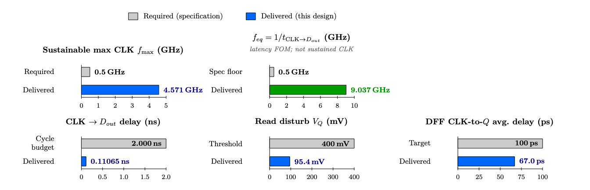
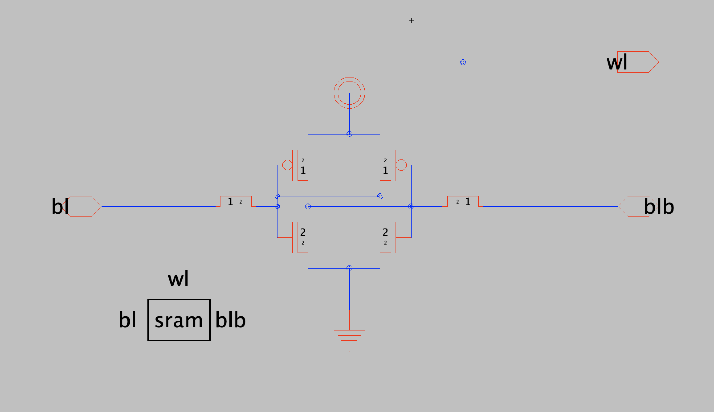
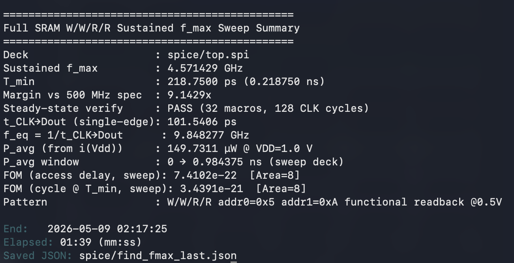
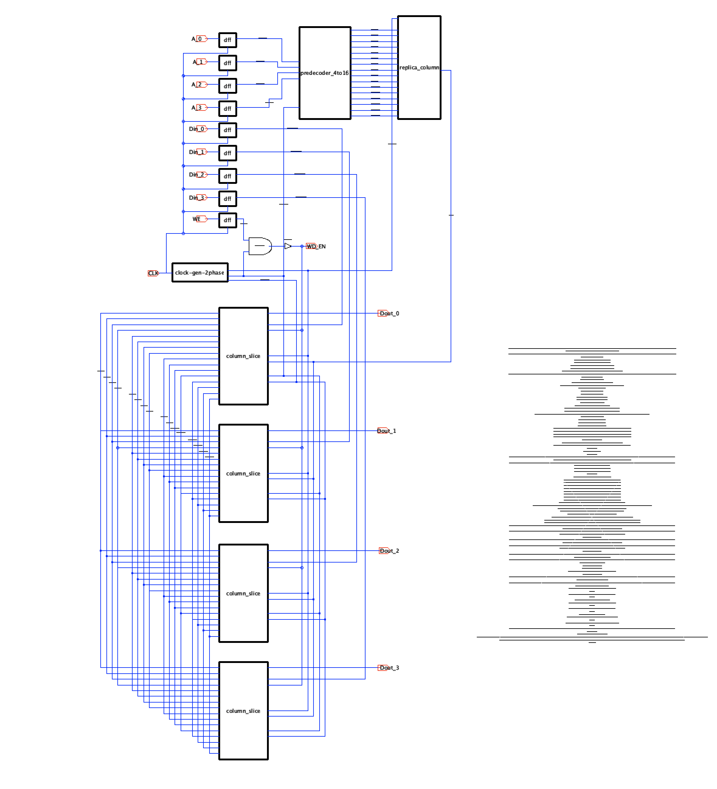
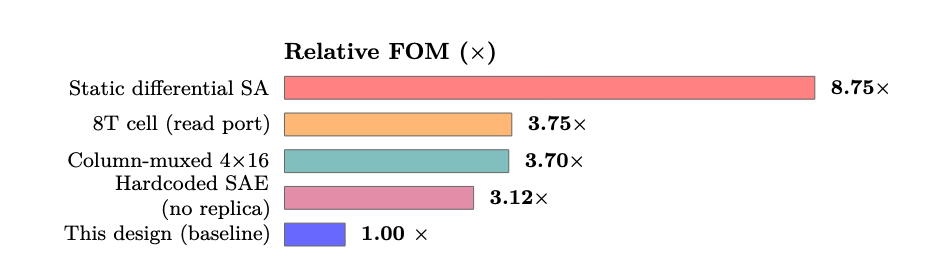
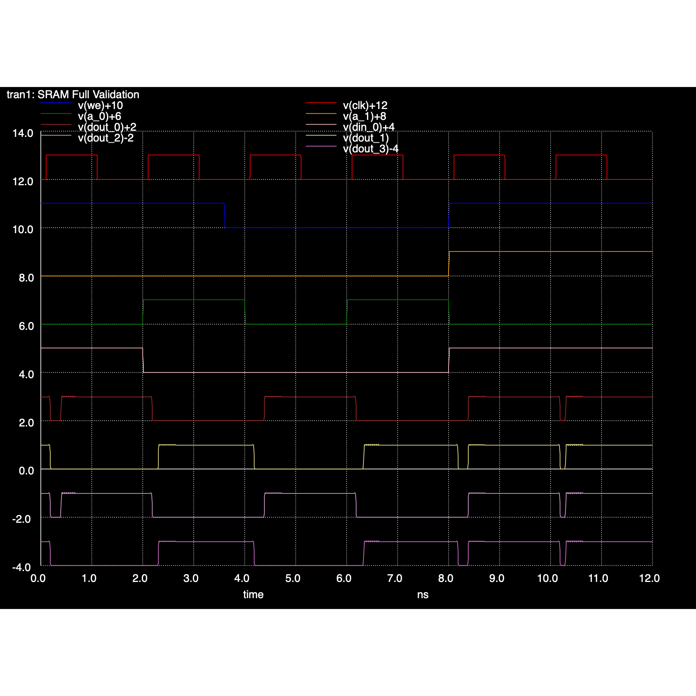

# 64 b SRAM Memory Design

[](https://github.com/tmarhguy/64b-sram/actions/workflows/latex-to-pdf.yml)
[](https://github.com/tmarhguy/64b-sram/blob/main/ESE3700_Proj2_Marhguy.tex)
[](https://github.com/tmarhguy/64b-sram)
[](https://github.com/tmarhguy/64b-sram/tree/main/spice)
[](https://github.com/tmarhguy/64b-sram)
[](https://github.com/tmarhguy/64b-sram/tree/main/spice)

The **required course work** is **Project 2** itself: a 16x4 SRAM design, analysis, and written report for **ESE 3700 - Spring 2026** (*Circuit Design and Optimization*) at the **University of Pennsylvania**, School of Engineering and Applied Science.

**This GitHub repository is not the official assignment submission.** It exists for documentation, and personal record-keeping: LaTeX source, figures, SPICE decks, Electric exports, validation evidence, and a CI-built PDF.

**Course assignment (instructor handout):** The Spring 2026 Project 2 specification—requirements, figure of merit, and what counts as the assigned work—is published by Penn Engineering for ESE 3700 here: [Project 2 handout (PDF)](https://www.seas.upenn.edu/~ese3700/spring2026/handouts/proj2.pdf). That PDF is **course material**, not something I wrote and **not** what this repository is hosting; it is linked only so readers can see the official brief. **This repo** is my own implementation, simulations, and write-up **for** that assignment.

**Author:** Tyrone Marhguy (contact links at the end of this page).

---

<p align="center">
  
  <br />
  <em>Figure 1 — Required vs. delivered headline metrics (from the LaTeX report).</em>
</p>

<p align="center">
  <em>ESE 3700, Spring 2026 - Project 2: 64 b SRAM in PTM 22 nm HP CMOS.</em>
</p>

## Overview

This repository documents a **64 b SRAM macro** organized as **16 words x 4 bits** in the PTM **22 nm High-Performance CMOS** process at `VDD = 1.0 V`. The design is optimized around the project figure of merit:

```text
FOM = 60 * BitcellArea * Power * Delay^2
```

Because delay is squared, the final architecture spends complexity in the periphery while keeping the repeated bitcell compact. The memory uses a standard 6T cell with asymmetric sizing (`CR = 2`, `PR = 1`), no column multiplexer, four parallel column slices, a clocked StrongARM sense amplifier, self-timed sense-amp enable from a replica bitline column, and a two-phase non-overlapping clocking scheme generated from the single external `CLK`.

**Full detail:** [ESE3700_Proj2_Marhguy.pdf](ESE3700_Proj2_Marhguy.pdf) is generated by CI after a successful LaTeX build on `main`. The source of truth is [ESE3700_Proj2_Marhguy.tex](ESE3700_Proj2_Marhguy.tex).

## Design Summary

| Item | Implemented design |
|------|--------------------|
| Memory organization | 16 rows x 4 columns; 64 b total |
| Process | PTM 22 nm High-Performance CMOS |
| Supply | `VDD = 1.0 V` |
| Interface | `A[3:0]`, `Din[3:0]`, `Dout[3:0]`, `WE`, single `CLK` |
| Bitcell | 6T SRAM cell, `CR = 2`, `PR = 1` |
| Bitcell area metric | `8 Wmin` summed transistor width |
| Read architecture | Precharge/equalize + bitline discharge + StrongARM sense amplifier |
| Write architecture | Tri-state inverter write driver per column |
| Timing | Replica bitline generates self-timed `SAE` |
| Clocking | Two-phase non-overlapping internal clocks from one external `CLK` |
| Array choice | No column mux; all four addressed bits are read/written in parallel |

<p align="center">
  
  <br />
  <em>6T bitcell (<code>CR = 2</code>, <code>PR = 1</code>) — full sizing context is in the PDF.</em>
</p>

## Key Results

All headline numbers below come from the LaTeX report and its cited SPICE evidence.

| Metric | Result |
|--------|--------|
| Sustainable max CLK frequency `fmax` (W/W/R/R sweep) | **3.329 GHz** (`T_min` = 0.300391 ns ≈ **300.39 ps**) |
| Equivalent frequency `feq = 1 / (CLK -> Dout)` (single-edge) | **7.00 GHz** |
| Top-level `CLK` to `Dout` (single read access) | **142.9 ps** |
| Frequency requirement | 500 MHz |
| Sustainable frequency margin | **6.658×** |
| Average top-level power | **248.0 uW** |
| Functional readback at 5 ns | **0x5 PASS** |
| Functional readback at 7 ns | **0xA PASS** |
| Bitcell write `1 -> 0` | **9.87 ps** |
| Bitcell write `0 -> 1` | **21.8 ps** |
| Read disturb maximum storage-node rise | **95.4 mV** |
| Final FOM (access-time delay) | **~2.43e-21** |

<p align="center">
  
  <br />
  <em><code>find_fmax.py</code> transcript: <strong>3.329 GHz</strong> sustainable <code>f_max</code>, <strong>0.300391 ns</strong> period, <strong>6.658×</strong> vs 500 MHz, <code>t_clk_to_dout</code> ≈ 140.4 ps at <code>T_min</code>, steady verify (8 W/W/R/R macros) PASS — <a href="media/terminal/fmax.png">media/terminal/fmax.png</a>.</em>
</p>

> Two distinct frequency claims and they are not the same number:
> - **`fmax`** comes from the cycle-stepped sweep in [`spice/find_fmax.py`](spice/find_fmax.py): binary search on CLK period with a **W/W/R/R** pattern each cycle, functional readback at **0.5 V**. After the search, the script optionally runs consecutive macros at `T_min` for steady-state check (screenshot: **8 macros** / 32 CLK cycles). Default CLI is quiet: use `python3 spice/find_fmax.py --json` for the full metric object on stdout.
> - **`feq = 7.00 GHz = 1 / 142.9 ps`** is the inverse of the single-edge CLK -> Dout access time reported by the `.control` block in `spice/top.spi`. This is the access-time figure that feeds the FOM delay term.
> Evidence: [media/terminal/fmax.png](media/terminal/fmax.png) (sweep + steady verify) and [media/terminal/final-top-final-terminal-out.png](media/terminal/final-top-final-terminal-out.png) (500 MHz validation deck).

## Architecture

The top level registers all inputs, decodes the 4-bit address into sixteen wordlines, activates four identical column slices, and uses a replica column to time the read decision.

Key architectural choices:

- **16x4 organization, no column mux:** avoids a pass-gate mux in the read path and keeps bitline capacitance low for this small array.
- **6T bitcell:** keeps the repeated area term low while meeting read stability and writeability targets with `CR = 2`, `PR = 1`.
- **StrongARM sensing:** provides fast regenerative readout without static sense-amp current.
- **Replica timing:** tracks real bitline discharge better than a fixed inverter-chain delay.
- **Two-phase clocking:** separates precharge from active wordline/write/sense windows to reduce contention.

<br />
<br />

<h3 align="center">Top-level macro</h3>

<p align="center">
  
  <br />
  <em>Electric export; PNG flattened on white.</em>
</p>

## Diagrams from the LaTeX report

Screenshots of PDF figures live under [`media/readme/`](media/readme/) as **`figN.png`** (printed **Figure N** in [`ESE3700_Proj2_Marhguy.pdf`](ESE3700_Proj2_Marhguy.pdf)). **Figure 1** is already at the top of this page; the full TikZ / methodology figures are in the report—below are only a couple of extras worth scrolling on GitHub.

> Decoder / SA / write paths **do not** add to the bitcell-area FOM term—only the repeated 6T width does ([§2 in the PDF](ESE3700_Proj2_Marhguy.pdf)).

### Highlights

**Figure 43 — FOM sensitivity** (`fig:fom_sensitivity_bars`)

<p align="center">
  
</p>

### Other README snapshots (same folder)

| Fig | File |
|-----|------|
| 2 — Report flow | [`fig2.png`](media/readme/fig2.png) |
| 3 — FOM pipeline | [`fig3.png`](media/readme/fig3.png) |
| 4 — Array organization | [`fig4.png`](media/readme/fig4.png) |
| 39 — Read delay stack | [`fig39.png`](media/readme/fig39.png) |
| 40 — Write delay stack | [`fig40.png`](media/readme/fig40.png) |
| 42 — Energy split | [`fig42.png`](media/readme/fig42.png) |

## Figures

The [**PDF report**](ESE3700_Proj2_Marhguy.pdf) contains the complete schematic set (column slice, precharge, sense amp, decoder, etc.). Top-level behavioral simulation:

<p align="center">
  
  <br />
  <em>Top-level validation: writes then reads <code>0x5</code> and <code>0xA</code>.</em>
</p>

## Repository Layout

| Path | Description |
|------|-------------|
| [ESE3700_Proj2_Marhguy.tex](ESE3700_Proj2_Marhguy.tex) | LaTeX source for the full report |
| [ESE3700_Proj2_Marhguy.pdf](ESE3700_Proj2_Marhguy.pdf) | Compiled report PDF, produced by CI after a successful run |
| [media/](media/) | Figures, schematics, waveform PNGs, and terminal captures cited by the report |
| [media/readme/](media/readme/) | README diagrams: **`figN.png`** = PDF Figure *N* (screenshots of report figures) |
| [spice/](spice/) | SPICE netlists, Electric libraries, simulation helpers, and SVG waveform masters |
| [spice/find_fmax.py](spice/find_fmax.py) | Cycle-scaled maximum-frequency sweep driver |
| [.github/workflows/](.github/workflows/) | GitHub Actions workflow for building and committing the report PDF |
| [scripts/](scripts/) | Optional local helpers for CI-like LaTeX builds |

## Build The Report Locally

Requirements: a modern TeX distribution with `latexmk`, or Docker/Podman for the containerized helper script.

Native build:

```bash
latexmk -pdf -file-line-error -halt-on-error -interaction=nonstopmode ESE3700_Proj2_Marhguy.tex
```

Containerized build matching the GitHub Action:

```bash
./scripts/run-latex-ci-local.sh
```

The local helper uses the same TeX Live container family as the CI workflow.

## Continuous Integration

The [LaTeX to PDF](.github/workflows/latex-to-pdf.yml) workflow is configured to run on pushes to `main` or `master` when the LaTeX source, figures, or workflow change. It compiles `ESE3700_Proj2_Marhguy.tex` and commits only `ESE3700_Proj2_Marhguy.pdf` back to the repository with `[skip ci]` in the commit message.

The workflow also supports manual `workflow_dispatch`, which is useful for the first PDF build after the repository is pushed. Until the workflow has run at least once on GitHub, the badge at the top may show no status.

## SPICE Notes

The SPICE decks are exported from Electric VLSI and use a PTM-style 22 nm HP model card. Some decks may contain local `.include` paths from the author's machine; update those paths to your local `22nm_HP.pm` before running simulations elsewhere.

Important entry points:

- [spice/top.spi](spice/top.spi): top-level netlist and validation driver. The embedded `.control` block prints the headline `t_clk_to_dout` (single-edge access), `iavg_vdd`, `pavg_mw`, and `f_eq_ghz = 1 / t_clk_to_dout` used in the report.
- [spice/find_fmax.py](spice/find_fmax.py): cycle-stepped `fmax` sweep driver. Binary-searches the CLK period under a 4-cycle write/write/read/read schedule against the live `top.spi`; closes at **`T_min ≈ 300.39 ps`** (**`fmax ≈ 3.329 GHz`**). Run with `--json` for metrics only on stdout.
- [spice/sram_6t_cell.spi](spice/sram_6t_cell.spi): repeated 6T memory bitcell.
- [spice/column_slice.spi](spice/column_slice.spi): precharge, write driver, sense amp, and output latch integration.
- [spice/replica_column.spi](spice/replica_column.spi): dummy-column timing path for self-timed `SAE`.

## Academic Integrity

This work was completed in compliance with the **University of Pennsylvania Code of Academic Integrity**, as stated on the report title page. This repository is an archive of the author's own project materials and should not be treated as a substitute for any course submission process.

## Citation And Reuse

If you reuse figures, netlists, or excerpts for coursework or research, cite or link this repository and the course context appropriately. The authoritative technical narrative, assumptions, measurement conditions, and conclusions are in the PDF report.

**Suggested GitHub topics:** `sram`, `vlsi`, `spice`, `latex`, `cmos`, `memory`, `22nm`, `ese3700`, `upenn`.

## Contact

[](mailto:tmarhguy@gmail.com)
[](mailto:tmarhguy@seas.upenn.edu)
[](https://www.linkedin.com/in/tmarhguy/)
[](https://twitter.com/marhguy_tyrone)
[](https://instagram.com/tmarhguy)
[](https://tmarhguy.substack.com)
